# 💡 Rusula Oshadha Pathirana

🎓 **Undergraduate in Electronics and Telecommunication Engineering**  
📍 **University of Moratuwa, Sri Lanka**  
🌟 Passionate about **FPGA Development**, **Power Electronics**, and **Embedded Systems**.

---

## 🌐 Connect with Me

  

---

## 🛠️ Technical Skills

### ⚙️ **Hardware Design & Development**
- 💻 **FPGA Tools**: Quartus, iCE Studio, ModelSim  
- 🔌 **HDL Languages**: Verilog, VHDL  
- 🧠 Microcontrollers: C/C++, Assembly, PIC & Embedded C

### 🔋 **Power Electronics**
- Power conversion circuits  
- Frequency-to-voltage converters  
- Smart solar inverter systems

### 📡 **Embedded Systems**
- Real-time systems with Nios II on MAX10 FPGA  
- IoT integration using MQTT and Node-RED  
- PIC and PLC Programming

---

## 🚀 Featured Projects

### 1️⃣ **Transitioning to DE10-Lite FPGA: A Flexible Custom Nios II CPU Implementation**

This project showcases the evolution of my custom CPU design, moving from a PCB-based implementation to the DE10-Lite FPGA, leveraging Hardware Descriptive Languages (HDLs) for enhanced flexibility and scalability.

  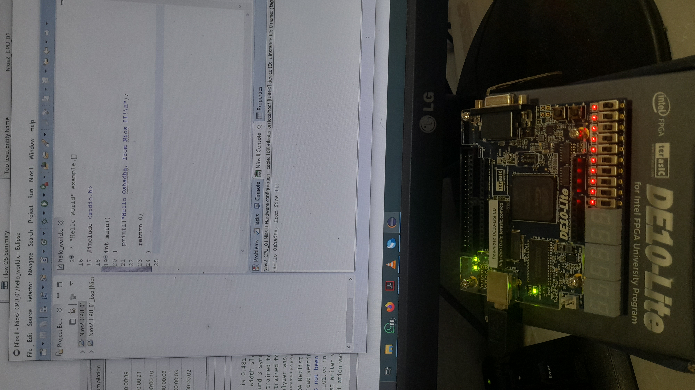
  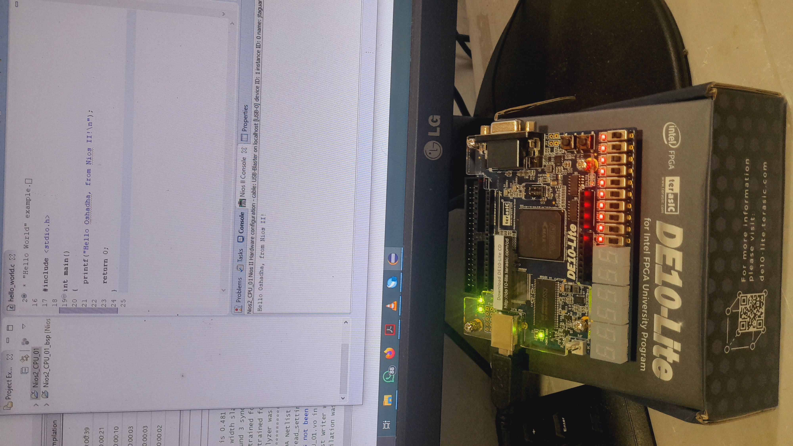

#### 🔑 Key Highlights:
- **Platform:** DE10-Lite FPGA using Intel Quartus Prime and Platform Designer tools(Nios II CPUs).  
- **Memory:** 8MB SDRAM for efficient data handling.  
- **Compatibility:** Arduino support, enabling integration with various peripherals.  
- **Programming Support:** C and C++ for streamlined application development.

#### 🌐 System-on-Chip (SoC) Design:
- Efficient execution of computational tasks.  
- Real-time applications, such as interrupt-based multitasking.

#### 🚀 Future Enhancements:
- Addition of custom instructions to optimize specific operations.  
- Integration of additional peripherals for enhanced functionality and scalability.

---

### 2️⃣ **PCB-Based 8-Bit CPU Design**

💾 Designed and implemented a CPU using Logic ICs and the CD40181 ALU.  
📐 **Highlights**: PCB design for backboard integration, micro-operations programming.

  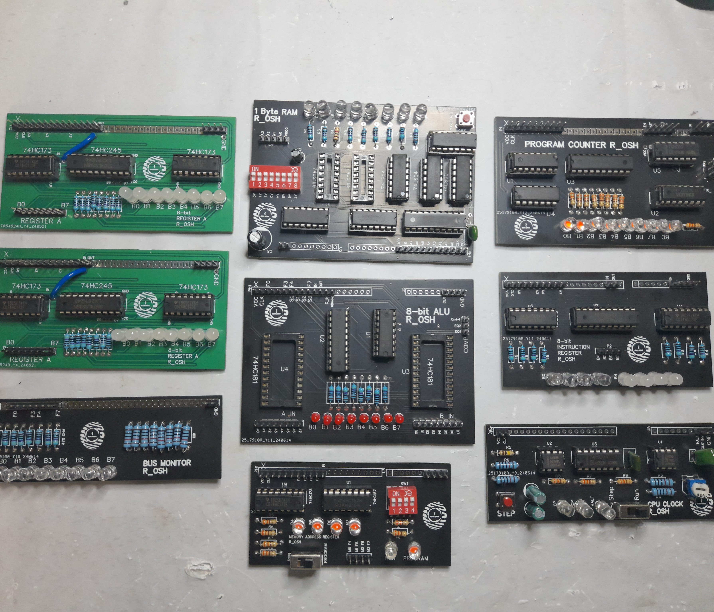
  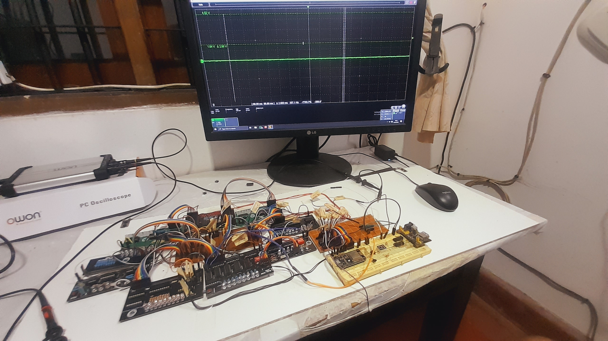
  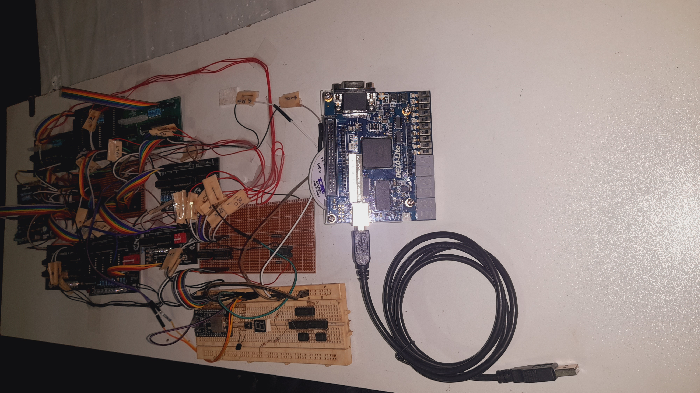

🧠 This project dives deep into microarchitecture, with an 8-bit bus width, support for both 4-bit and 8-bit instructions, and 128 bits of RAM. The control unit and micro-ops programming are underway, and once done, everything will be mounted to a backboard. 
I have been working on my CPU project for about a month now. I managed to troubleshoot most of the PCBs and even tested them after integration.

Here, the CPU is adding one number (register A) to another number (register B) in a continuous loop. I still use a set of wires to do the CU part manually. First, I have to select the correct circuit of the ALU to do the addition. And load two numbers into the registers by fetching them from the RAM. Then, I setup the program counter to do a never-ending loop. 

I have learned a lot during this phase of the project and still have many things to learn in this CPU build journey.

🔗 [8-Bit CPU with CD40181 ALU on PCBs](https://github.com/OshadhaPathirana/8-Bit-CPU-with-CD40181-ALU-on-PCBs)

---

### 3️⃣ **Smart Solar Inverter System**

🔋 A cutting-edge solution for efficient solar power generation with integrated IoT monitoring.  
🛠️ **Technologies**: Embedded C, Node-RED, MQTT, Power Electronics  
📈 **Outcome**: Enhanced energy efficiency and anomaly detection.

  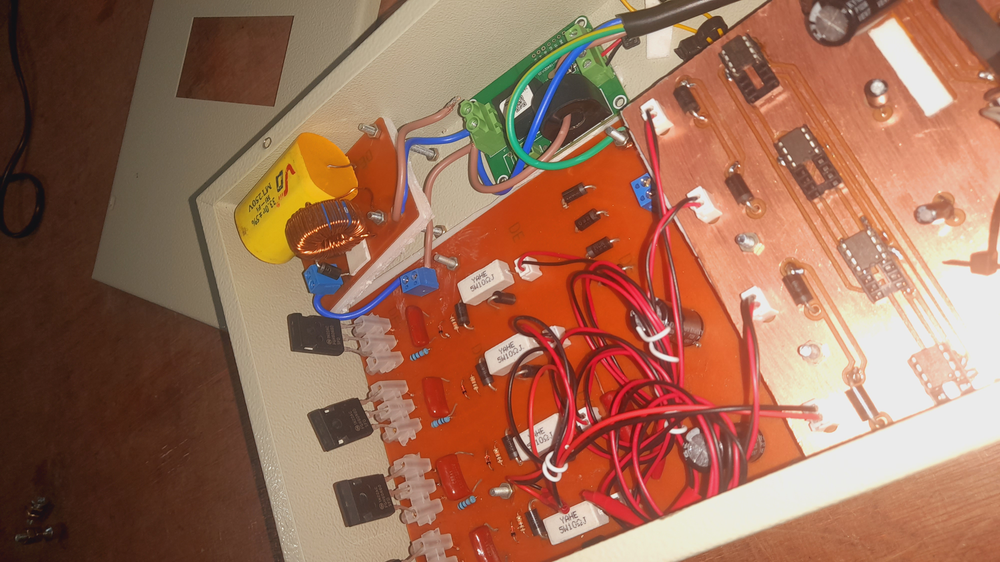
  
  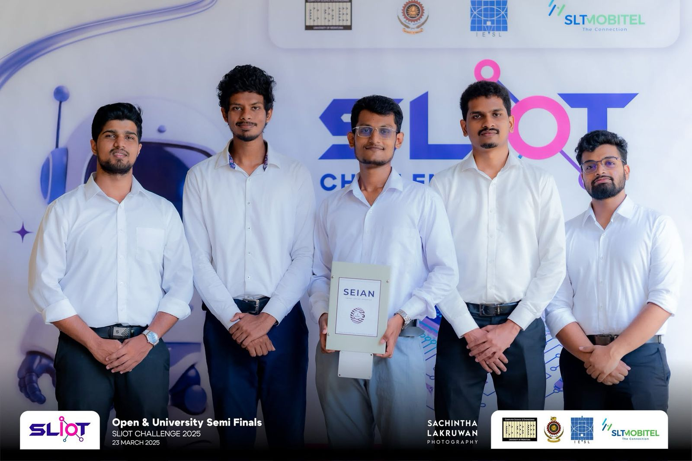

What sets us apart?

🔹 Smart Control System for real-time optimization
🔹Synchronized energy sharing for maximum efficiency
🔹Ideal for off-grid locations and Kabana-type hotels needing reliable, synchronized solar power
🔹Focused on marketability and sustainable impact

Our goal? To enable maximum energy utilization, minimize losses, and deliver reliable, scalable solar energy for a greener future. 🌱

We're excited to take SEIAN to the next level!
🔗 <a href="https://github.com/OshadhaPathirana/Smart-Energy-Automation-and-Integration-Network-2025" style="font-size:6px;">
  SEIAN inverter System
</a>

---

### 🧠 **SLIoT Challenge 2023 – Smart Inverter & Monitoring System**

Our inverter isn’t just another solar solution — it’s an intelligent power management system, built for precision, stability, and scalability. With seamless integration of multiple inverters, SEIAN is designed to scale effortlessly from homes to industrial setups.

  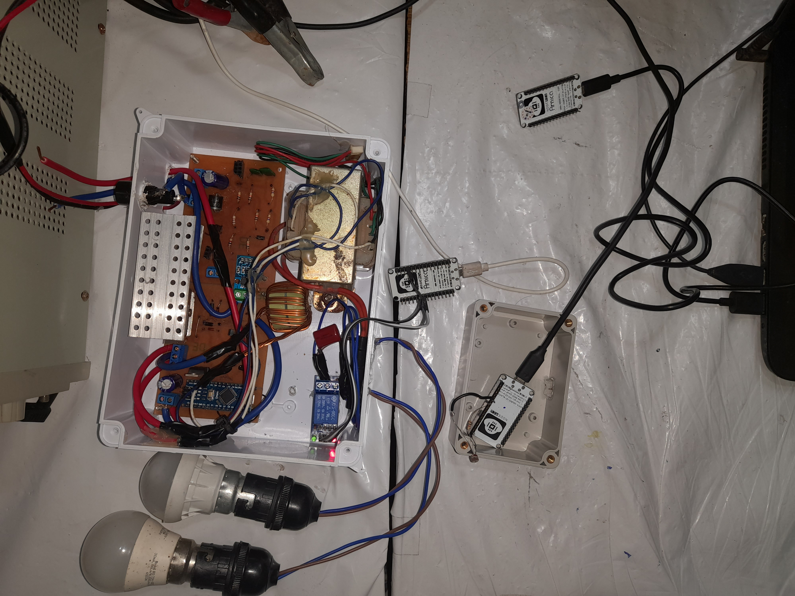
  

---

### ⚡ **Smart Energy Integration and Automation Network (SEIAN)**  
#### 🛠 Smart Power and VFD Units

  
  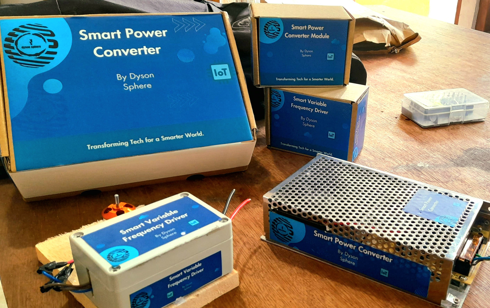

This project is later developped into SEIAN 2025 Inverter system.

🔗 <a href="https://github.com/OshadhaPathirana/Smart-Solar-Inverter-SSI---UpThrust" style="font-size:6px;">
  SEIAN Inverter / Industrial power management system
</a>
---

### 🤖 **Sri Lanka Robotics Challenge 2025**  
#### 🥈 2nd Place Winning Robot

  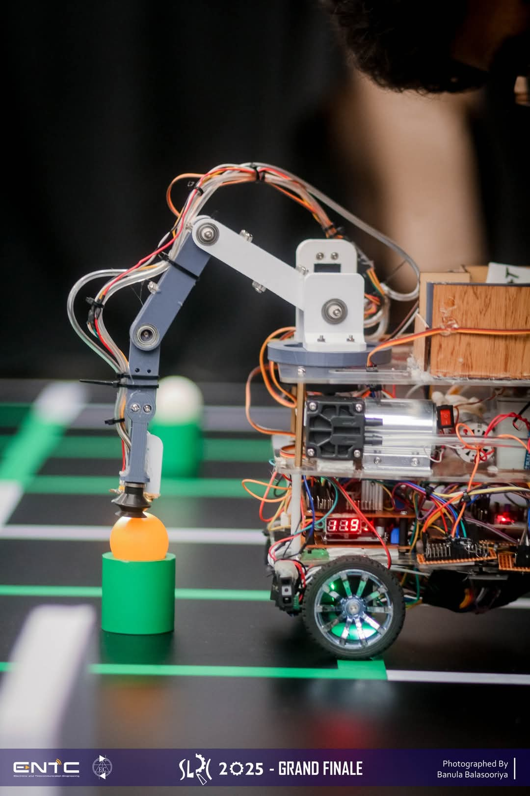
  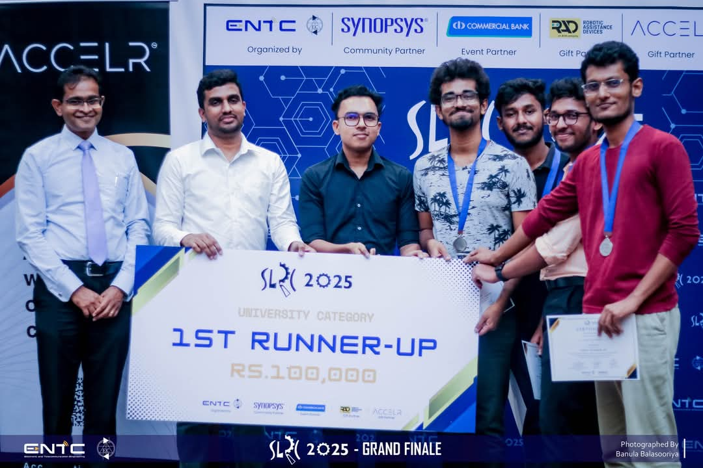

---

## 🏆 Achievements

- 🥇 **Singapore Space Challenge** (2021): Distinction Award for innovative rover mobility solutions.  
- 🥈 **SLIoT Challenge** (2022): Second place for IoT-powered smart energy networks.  
- 🏅 **Patent Holder**: Automated extendable drill design (LK21652) & Self-adapting wheel system (SAWS) (LK21653).

---

## 📚 Publications

- **[A self adapting wheel system for space exploration rovers](https://iafastro.directory/iac/paper/id/65366/summary/)** – IAC 2021, Dubai  
- **[SOIL PENETRATION DARTS (SPDs)](https://iafastro.directory/iac/paper/id/72590/summary/)** – IAC 2022, Paris  
- **[Economical Lunar Sample Return Mission](https://iafastro.directory/iac/paper/id/89101/summary/)** – IAC 2024, Milan

---

## 🎯 My Goals

- 💡 Build innovative solutions in **FPGA and Power Electronics**  
- 🌱 Contribute to open-source projects  
- 🔍 Explore opportunities to apply FPGA in energy-efficient systems

---

## 🎨 Engaging Facts

- 🌟 Founder of Dyson Sphere, a project group of undergraduates focused on Renewable Energy and IoT.  
- 🚀 Dreaming of contributing to space exploration technology.  
- 🌍 Actively participates in hackathons and engineering competitions.

---

_"Engineering is not only a field, but a way of solving problems to make the world better!"_
